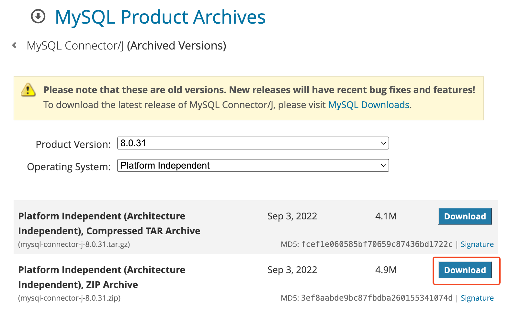

## lombok 라이브러리 추가 - build.gradle

- //Lombok
- compileOnly 'org.projectlombok:lombok:1.18.34'
- annotationProcessor 'org.projectlombok:lombok:1.18.34'
    

## MySQL JDBC 드라이버 추가 - build.gradle

- //MySQL JDBC driver
- implementation 'org.springframework.boot:spring-boot-starter-jdbc'
- runtimeOnly 'mysql:mysql-connector-java:8.0.31'
    

## MySQL JDBC 드라이버 다운로드 및 추가

공식사이트에서 다운로드 : https://downloads.mysql.com/archives/c-j/

### JAR 파일 추가

- `File` 메뉴에서 `Project Structure` (또는 단축키 `Ctrl+Alt+Shift+S`)를 선택
- `Modules`를 선택한 후, 오른쪽 패널에서 `Dependencies` 탭을 클릭.
- `+` 버튼을 클릭하고 `JARs or directories`를 선택
- `lib` 디렉토리에서 `mysql-connector-java-8.0.39.jar` 파일을 선택
- `Apply`와 `OK`를 클릭하여 변경 사항을 저장

### 프로젝트 Clean & Rebuild

- IntelliJ IDEA에서 `Build` 메뉴로 가서 `Rebuild Project`를 선택
- `File` 메뉴에서 `Invalidate Caches / Restart`를 선택하고, `Invalidate and Restart` 버튼을 클릭
    

## MySQL 연동 설정 - backend/src/main/resources/application.properties

- spring.datasource.url=jdbc:mysql://localhost:3306/데이터베이스명
- spring.datasource.username=root
- spring.datasource.password=mysql1234
- spring.datasource.driver-class-name=com.mysql.cj.jdbc.Driver
